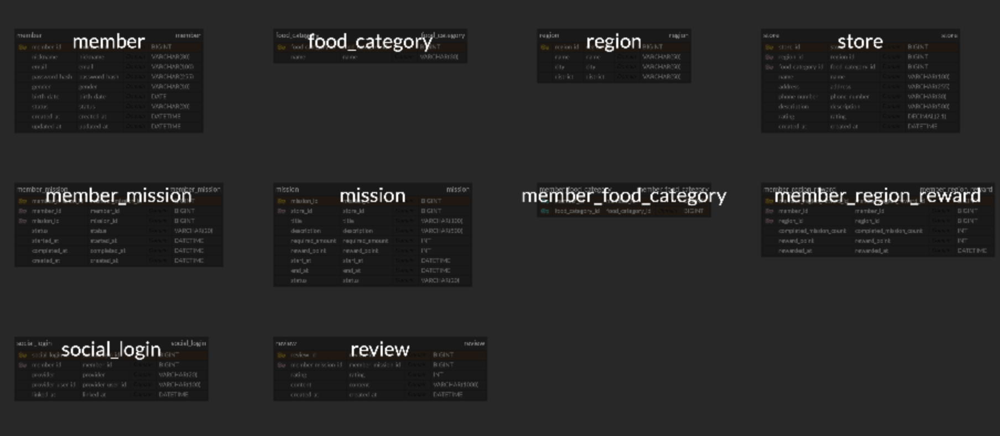
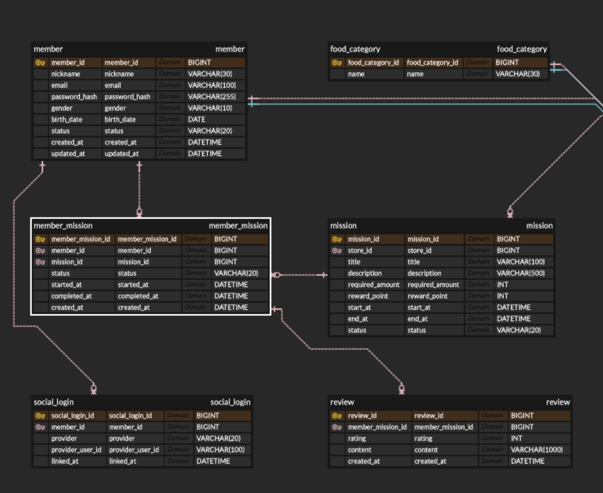
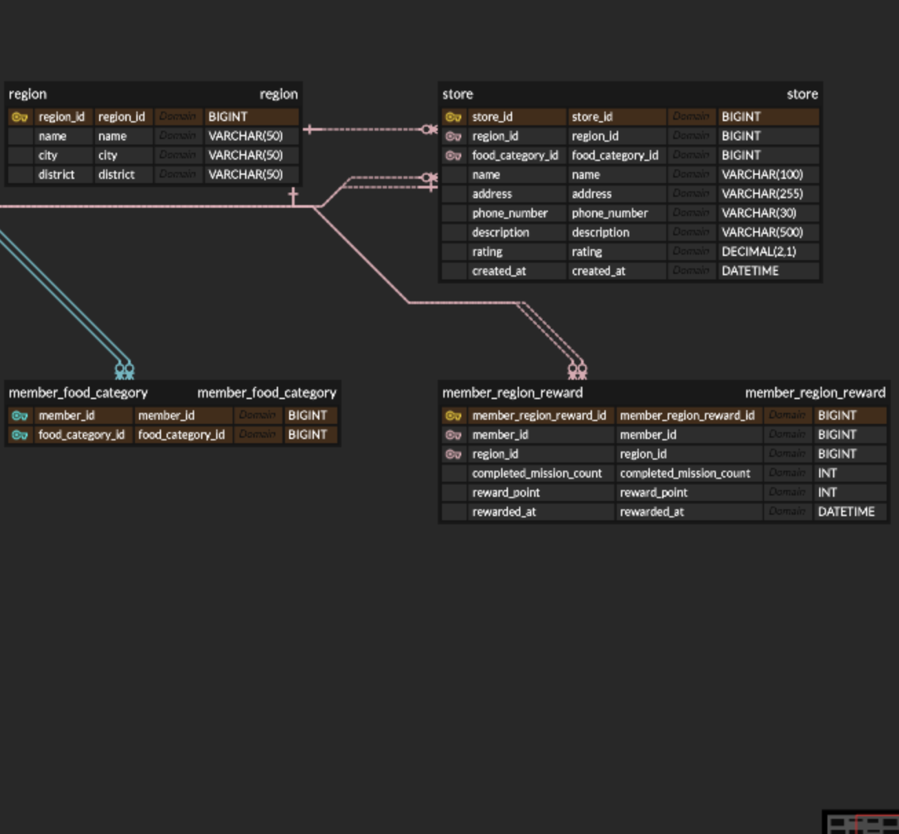

# UMC 미션 리워드 서비스 ERD

## 1. 설계 개요

주어진 IA와 와이어프레임을 분석하여 회원가입 및 로그인, 선호 음식 선택, 지역별 가게 조회, 미션 수행, 리뷰 작성 흐름을 중심으로 ERD를 설계했다.

서비스의 핵심 요구사항인 "각 지역의 가게에서 미션을 수행하고, 지역별 미션 10개를 완료하면 1,000포인트를 지급한다"는 규칙을 데이터로 관리할 수 있도록 회원, 지역, 가게, 미션, 수행 이력, 지역 보상 테이블을 구성했다.

## 2. 전체 ERD

## 3. 핵심 영역 상세

### 3.1 회원, 미션, 리뷰 영역

- `member`는 회원의 닉네임, 이메일, 비밀번호, 성별, 생년월일, 상태와 생성·수정 시점을 관리한다.
- `social_login`은 카카오, 네이버, 구글 등의 소셜 로그인 제공자와 제공자별 사용자 식별값을 관리한다. 한 회원이 여러 소셜 계정을 연결할 수 있으므로 `member`와 `social_login`을 일대다 관계로 설계했다.
- `mission`은 특정 가게가 제공하는 미션의 제목, 설명, 최소 주문 금액, 보상 포인트, 진행 기간과 상태를 관리한다.
- 회원과 미션은 다대다 관계이므로 `member_mission`을 중간 테이블로 두었다. 이 테이블에는 회원이 선택한 미션의 진행 상태와 시작·완료 시점을 저장한다.
- `review`는 실제 미션 수행 내역인 `member_mission`을 기준으로 작성한다. `member_mission_id`에 유일성 제약을 적용하여 하나의 미션 수행 내역에 최대 한 개의 리뷰만 작성할 수 있도록 했다.

### 3.2 지역, 가게, 음식 카테고리, 보상 영역

- `region`은 지역명, 시·도, 구·군 정보를 관리하며 하나의 지역은 여러 가게를 포함한다.
- `store`는 가게 이름, 주소, 전화번호, 설명, 평점과 생성 시점을 관리한다. 각 가게는 하나의 지역과 음식 카테고리에 속한다.
- `food_category`는 한식, 중식, 일식과 같은 음식 종류를 관리한다.
- 회원은 여러 음식 카테고리를 선호할 수 있고 하나의 음식 카테고리를 여러 회원이 선택할 수 있으므로 `member_food_category`를 중간 테이블로 구성했다. `member_id`와 `food_category_id`를 복합 기본키로 사용하여 같은 카테고리가 중복 선택되는 것을 방지했다.
- `member_region_reward`는 회원이 특정 지역에서 완료한 미션 수, 지급 포인트와 지급 시점을 관리한다. 이를 통해 지역별 미션 10개 완료 시 1,000포인트를 지급하고, 동일한 보상이 중복 지급되는 것을 방지할 수 있다.

## 4. 주요 관계

| 부모 테이블 | 자식 테이블 | 관계 | 설명 |
| --- | --- | --- | --- |
| `member` | `social_login` | 1:N | 한 회원이 여러 소셜 계정을 연결할 수 있다. |
| `member` | `member_food_category` | 1:N | 회원별 선호 음식 카테고리를 저장한다. |
| `food_category` | `member_food_category` | 1:N | 하나의 카테고리를 여러 회원이 선택할 수 있다. |
| `region` | `store` | 1:N | 한 지역에 여러 가게가 존재한다. |
| `food_category` | `store` | 1:N | 하나의 음식 카테고리에 여러 가게가 속한다. |
| `store` | `mission` | 1:N | 한 가게가 여러 미션을 제공할 수 있다. |
| `member` | `member_mission` | 1:N | 회원별 미션 수행 내역을 저장한다. |
| `mission` | `member_mission` | 1:N | 하나의 미션에 여러 회원이 참여할 수 있다. |
| `member_mission` | `review` | 1:0..1 | 완료한 미션 수행 내역에 리뷰를 최대 한 개 작성한다. |
| `member` | `member_region_reward` | 1:N | 회원별 지역 보상 지급 이력을 저장한다. |
| `region` | `member_region_reward` | 1:N | 지역별 완료 횟수와 보상 지급 정보를 저장한다. |

## 5. 지역 보상 처리 방식

회원이 미션을 완료하면 `member_mission.status`를 완료 상태로 변경하고 `completed_at`에 완료 시점을 저장한다. 이후 `mission`, `store`, `region`을 순서대로 조인하여 해당 회원이 특정 지역에서 완료한 미션 수를 계산한다.

완료한 미션 수가 10개 단위에 도달하면 `member_region_reward`에 완료 미션 수, 1,000포인트와 지급 시점을 기록한다. 보상 지급 이력을 별도 테이블에 저장하므로 지역별 달성 여부를 확인할 수 있고 동일 조건에 대한 중복 지급도 방지할 수 있다.

## 6. 설계 범위

이번 ERD는 필수 요구사항에 집중하여 로그인 및 회원가입, 지역·가게·음식 카테고리, 미션 목록과 수행 내역을 포함했다. 난이도 완화를 위해 제외 가능한 지도 및 검색, 전체 포인트 사용 내역, 알림 설정, 사장님의 점포 관리 기능은 설계 범위에서 제외했다.
