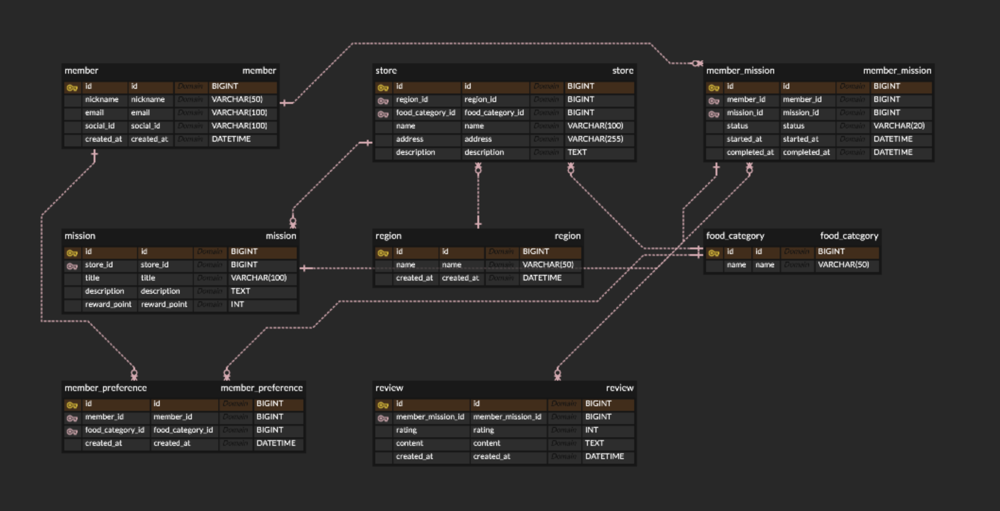

# ERD 설계

## 서비스 개요

지역별 가게를 방문하고 미션을 수행해 포인트를 받는 리워드 서비스입니다. 지역별 미션 10개를 모두 완료하면 1,000 Point를 지급하는 흐름을 기준으로 설계했습니다.

## 핵심 테이블

- **member**: 일반 회원 및 소셜 로그인 식별자
- **member_preference**: 가입 후 선호 음식 카테고리
- **region**: 서비스 지역
- **store**: 지역에 속한 가게
- **food_category**: 가게 음식 카테고리
- **mission**: 가게 방문 미션과 보상 포인트
- **member_mission**: 회원별 미션 수행 상태
- **review**: 미션 완료 후 작성하는 리뷰

## 관계

- 회원 1명은 여러 미션을 수행할 수 있고, 미션 1개는 여러 회원이 수행할 수 있어 `member_mission`으로 연결했습니다.
- 지역 1개에 여러 가게가 속합니다.
- 가게 1개에 여러 미션이 연결됩니다.
- 완료된 `member_mission`만 리뷰를 작성할 수 있습니다.
- 지도/검색, 포인트 지갑, 알림 설정, 사장님 관리 기능은 MVP 범위에서 제외했습니다.

